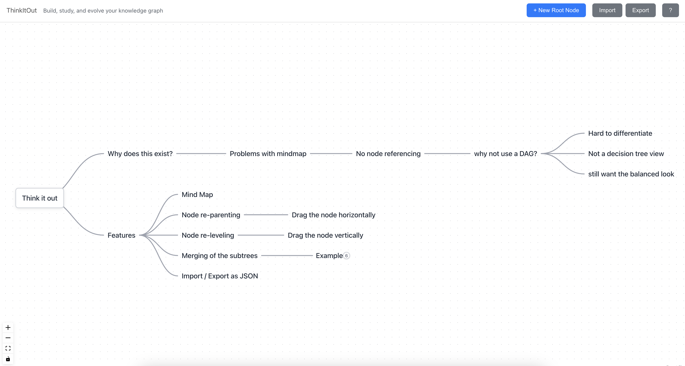

# ThinkItOut - WIP

I was building a knowledge based decision tree, where a set of decisions kept re appearing - in which copying the entire subtree for each was not viable. I could not find any tool which does linking of nodes in a clean fashion.

Here is my attempt to solve that usecase. This will be a keyboard first mindgraph - a mindmap where you can hyperlink nodes - so a graph :)



### Installation

```bash
npm install
```

### Development

```bash
npm run dev
```

### Build

```bash
npm run build
```

## Usage

### Keyboard Shortcuts (Whimsical-style!)

- **⌘/Ctrl + N**: Create a new root node
- **Enter**: Create a sibling node (same depth as current) + auto-edit
- **Tab**: Create a child node (one level deeper) + auto-edit
- **Delete/Backspace**: Delete selected nodes and their entire subtrees
- **Double-click node**: Edit node inline
- **Click node**: Focus node for keyboard navigation
- **Drag node vertically**: Reorder sibling nodes (change vertical position)
- **Drag node horizontally 100px+**: Reparent node to new parent (moves entire subtree!)
  - Subtle gray borders show valid drop targets
  - Ghost edge preview shows new connection
  - 🛡️ Prevents circular dependencies automatically
- **Space + Drag**: Pan the canvas
- **Click + Drag**: Multi-select nodes (box selection)
- **Shift + Click**: Add to selection

### Navigation

- **Arrow Left**: Move to parent node
- **Arrow Right**: Move to first child node
- **Arrow Up**: Move to previous sibling
- **Arrow Down**: Move to next sibling

## Tech Stack

- **React** + **TypeScript**
- **React Flow** for canvas rendering
- **Vite** for build tooling
- **localStorage** for persistence

## Documentation

- **[Layout System Guide](LAYOUT_GUIDE.md)** - Comprehensive guide on how the tree layout works and how to tune spacing variables

---
